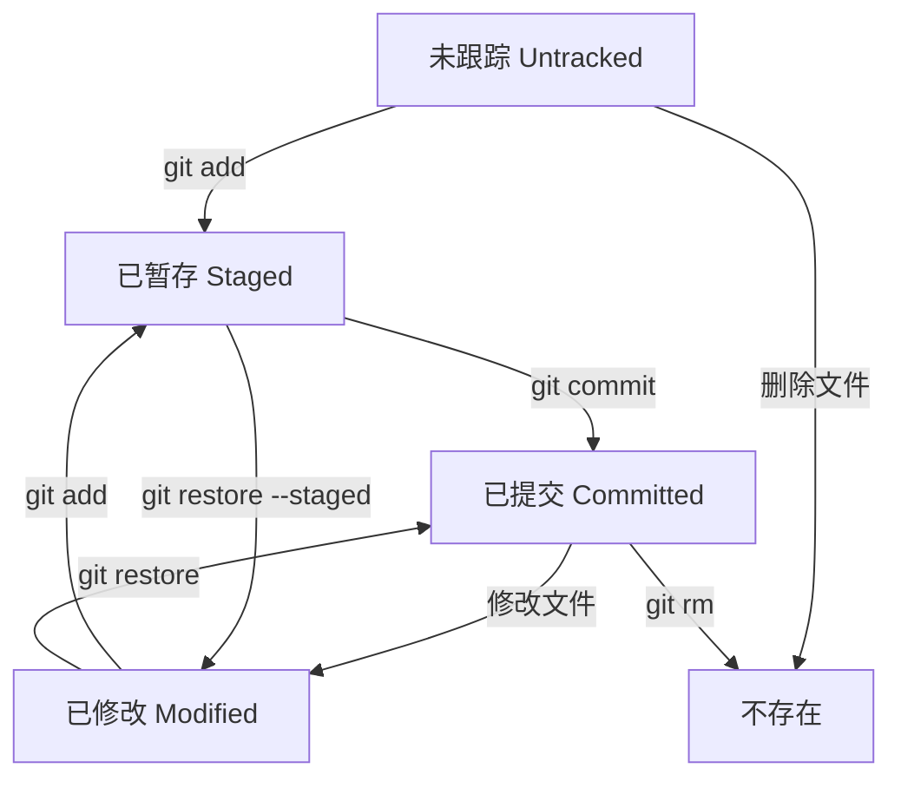

# 文件状态与追踪

## Git文件状态概述

在Git中，文件有四种主要状态：

1. **未跟踪（Untracked）**：新创建的文件，Git不管理这些文件
2. **已修改（Modified）**：已跟踪文件被修改，但未暂存
3. **已暂存（Staged）**：文件已添加到暂存区，准备提交
4. **已提交（Committed）**：文件已安全保存在Git目录中

## 查看文件状态

### git status命令

`git status`命令用于查看工作区和暂存区的状态。

#### 基本语法

```bash
git status [选项]
```

#### 常用选项

- `-s` 或 `--short`：以简洁格式显示状态
- `-b` 或 `--branch`：显示分支信息
- `--ignored`：显示被忽略的文件
- `--porcelain`：机器可读的格式输出

#### 使用示例

##### 1. 基本状态查看

```bash
# 查看详细状态
git status

# 输出示例
On branch main
Your branch is up to date with 'origin/main'.

Changes not staged for commit:
  (use "git add <file>..." to update what will be committed)
  (use "git restore <file>..." to discard changes in working directory)
        modified:   src/main.py

Untracked files:
  (use "git add <file>..." to include in what will be committed)
        new-file.txt

no changes added to commit (use "git add" and/or "git commit -a")
```

##### 2. 简洁格式状态

```bash
# 查看简洁状态
git status -s

# 输出示例
 M src/main.py
?? new-file.txt
```

##### 3. 显示分支信息

```bash
# 查看状态和分支信息
git status -b

# 输出示例
## main...origin/main
 M src/main.py
?? new-file.txt
```

### 状态符号说明

| 符号 | 含义 | 说明 |
|------|------|------|
| ` ` | 未修改 | 文件未修改 |
| `M` | 已修改 | 文件已被修改 |
| `A` | 已添加 | 新文件已添加到暂存区 |
| `D` | 已删除 | 文件已删除 |
| `R` | 已重命名 | 文件已重命名 |
| `C` | 已复制 | 文件已复制 |
| `U` | 更新但未合并 | 文件有冲突需要解决 |
| `?` | 未跟踪 | 新文件未被Git跟踪 |
| `!` | 已忽略 | 文件被.gitignore忽略 |

## 添加文件到暂存区

### git add命令

`git add`命令用于将文件添加到暂存区。

#### 基本语法

```bash
git add <文件路径>
```

#### 常用选项

- `.` 或 `*`：添加所有修改文件
- `-A` 或 `--all`：添加所有文件（包括删除的文件）
- `-u` 或 `--update`：只添加已跟踪的文件
- `-p` 或 `--patch`：交互式添加文件的部分修改
- `-f` 或 `--force`：强制添加被忽略的文件

#### 使用示例

##### 1. 添加单个文件

```bash
# 添加单个文件到暂存区
git add filename.txt

# 添加多个文件
git add file1.txt file2.txt file3.txt
```

##### 2. 添加所有修改文件

```bash
# 添加当前目录所有修改文件
git add .

# 添加所有修改文件（包括删除的文件）
git add -A
```

##### 3. 添加特定类型文件

```bash
# 添加所有Python文件
git add *.py

# 添加所有JavaScript文件
git add *.js
```

##### 4. 交互式添加

```bash
# 交互式添加文件的部分修改
git add -p

# 输出示例
diff --git a/src/main.py b/src/main.py
index 1234567..89abcde 100644
--- a/src/main.py
+++ b/src/main.py
@@ -1,5 +1,5 @@
 def hello():
-    print("Hello World")
+    print("Hello Git")
     return True
 
Stage this hunk [y,n,q,a,d,/,j,J,g,s,e,?]?
```

##### 5. 添加被忽略的文件

```bash
# 强制添加被忽略的文件
git add -f config.json
```

## 查看文件差异

### git diff命令

`git diff`命令用于查看文件差异。

#### 基本语法

```bash
git diff [选项] [文件路径]
```

#### 常用选项

- `--cached` 或 `--staged`：查看暂存区与最新提交的差异
- `HEAD`：查看工作区与最新提交的差异
- `HEAD~1`：查看工作区与倒数第二次提交的差异
- `--stat`：显示差异统计信息
- `--color-words`：以单词为单位显示差异

#### 使用示例

##### 1. 查看工作区差异

```bash
# 查看所有文件的差异
git diff

# 查看特定文件的差异
git diff src/main.py

# 输出示例
diff --git a/src/main.py b/src/main.py
index 1234567..89abcde 100644
--- a/src/main.py
+++ b/src/main.py
@@ -1,5 +1,5 @@
 def hello():
-    print("Hello World")
+    print("Hello Git")
     return True
```

##### 2. 查看暂存区差异

```bash
# 查看暂存区与最新提交的差异
git diff --cached

# 或使用
git diff --staged
```

##### 3. 查看统计信息

```bash
# 查看差异统计信息
git diff --stat

# 输出示例
 src/main.py | 2 +-
 1 file changed, 1 insertion(+), 1 deletion(-)
```

## 删除文件

### git rm命令

`git rm`命令用于删除文件并从暂存区移除。

#### 基本语法

```bash
git rm <文件路径>
```

#### 常用选项

- `-r`：递归删除目录
- `-f` 或 `--force`：强制删除
- `--cached`：只从暂存区删除，保留工作区文件

#### 使用示例

##### 1. 删除文件

```bash
# 删除文件
git rm filename.txt

# 删除多个文件
git rm file1.txt file2.txt
```

##### 2. 递归删除目录

```bash
# 递归删除目录
git rm -r directory/
```

##### 3. 只从暂存区删除

```bash
# 只从暂存区删除，保留工作区文件
git rm --cached filename.txt
```

## 移动和重命名文件

### git mv命令

`git mv`命令用于移动或重命名文件。

#### 基本语法

```bash
git mv <源文件> <目标文件>
```

#### 使用示例

##### 1. 重命名文件

```bash
# 重命名文件
git mv old-name.txt new-name.txt
```

##### 2. 移动文件

```bash
# 移动文件到目录
git mv filename.txt directory/

# 移动并重命名
git mv filename.txt directory/new-name.txt
```

## 忽略文件

### .gitignore文件

`.gitignore`文件用于指定Git应该忽略的文件和目录。

#### 基本语法

```bash
# 创建.gitignore文件
touch .gitignore
```

#### 规则语法

```gitignore
# 注释行
# 这是注释

# 忽略特定文件
config.json

# 忽略特定类型文件
*.log
*.tmp

# 忽略目录
node_modules/
__pycache__/

# 忽略目录下的特定文件
directory/*.txt

# 例外情况（不忽略）
!important.log

# 模式匹配
*.py[cod]
*.so
.Python
build/
develop-eggs/
dist/
downloads/
eggs/
.eggs/
lib/
lib64/
parts/
sdist/
var/
wheels/
*.egg-info/
.installed.cfg
*.egg
```

#### 常用忽略规则

```gitignore
# Python
__pycache__/
*.py[cod]
*$py.class
*.so
.Python
build/
develop-eggs/
dist/
downloads/
eggs/
.eggs/
lib/
lib64/
parts/
sdist/
var/
wheels/
*.egg-info/
.installed.cfg
*.egg

# Node.js
node_modules/
npm-debug.log*
yarn-debug.log*
yarn-error.log*

# Java
*.class
*.jar
*.war
*.ear
*.zip
*.tar.gz
*.rar

# IDE
.vscode/
.idea/
*.swp
*.swo
*~

# OS
.DS_Store
.DS_Store?
._*
.Spotlight-V100
.Trashes
ehthumbs.db
Thumbs.db
```

### git check-ignore命令

`git check-ignore`命令用于检查文件是否被忽略。

#### 基本语法

```bash
git check-ignore <文件路径>
```

#### 使用示例

```bash
# 检查文件是否被忽略
git check-ignore config.json

# 检查多个文件
git check-ignore file1.txt file2.txt

# 显示匹配的规则
git check-ignore -v config.json
```

## 恢复文件

### git restore命令

`git restore`命令用于恢复文件到之前的状态。

#### 基本语法

```bash
git restore <文件路径>
```

#### 常用选项

- `--staged`：从暂存区恢复文件
- `--source=<提交>`：从指定提交恢复文件
- `--worktree`：恢复工作区文件
- `--overlay`：不创建新文件

#### 使用示例

##### 1. 恢复工作区文件

```bash
# 恢复单个文件
git restore filename.txt

# 恢复多个文件
git restore file1.txt file2.txt

# 恢复所有文件
git restore .
```

##### 2. 从暂存区恢复

```bash
# 从暂存区恢复文件
git restore --staged filename.txt
```

##### 3. 从指定提交恢复

```bash
# 从指定提交恢复文件
git restore --source=HEAD~1 filename.txt
```

## 文件状态转换流程



## 最佳实践

### 1. 文件管理策略

- **频繁提交**：小步快跑，避免大提交
- **清晰命名**：使用有意义的文件名
- **合理组织**：按功能模块组织文件结构
- **及时清理**：定期清理无用文件

### 2. 状态检查习惯

- **定期检查**：经常使用`git status`查看状态
- **提交前检查**：提交前仔细检查暂存区内容
- **差异查看**：使用`git diff`查看修改内容
- **确认无误**：确保提交的内容符合预期

### 3. 忽略文件管理

- **项目级别**：在项目根目录创建.gitignore
- **全局级别**：配置全局.gitignore
- **模板使用**：使用现成的.gitignore模板
- **定期更新**：根据项目需求更新忽略规则

### 4. 安全考虑

- **敏感信息**：不要提交敏感信息
- **备份重要**：重要操作前先备份
- **确认操作**：删除操作前确认文件内容
- **版本控制**：重要文件使用版本控制

## 常见问题与解决方案

### 1. 文件状态混乱

**问题**：工作区有很多未提交的修改，状态混乱。

**解决方案**：
```bash
# 查看状态
git status

# 暂存当前工作
git stash

# 清理工作区
git clean -fd

# 恢复暂存的工作
git stash pop
```

### 2. 错误添加到暂存区

**问题**：不小心将错误的文件添加到暂存区。

**解决方案**：
```bash
# 取消暂存单个文件
git restore --staged filename.txt

# 取消暂存所有文件
git restore --staged .
```

### 3. 文件被忽略但需要跟踪

**问题**：文件被.gitignore忽略，但需要跟踪。

**解决方案**：
```bash
# 强制添加文件
git add -f filename.txt

# 修改.gitignore文件
# 在文件前添加!来例外
!important.log
```

## 总结

文件状态与追踪是Git版本控制的核心概念。掌握`git status`、`git add`、`git diff`、`git rm`、`git mv`等命令，以及`.gitignore`文件的使用，将帮助您更好地管理项目文件。

理解文件的生命周期和状态转换，养成良好的文件管理习惯，将大大提高您的开发效率和代码管理质量。在实际使用中，建议多练习这些命令，熟悉各种选项的使用场景。