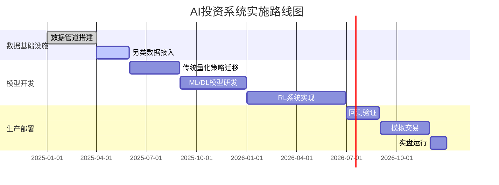

# AI辅助股票和基金投资

人工智能正在改变投资决策的方式，从市场分析到投资组合管理，AI工具为投资者提供了数据驱动的洞察和自动化决策支持。本章将介绍如何利用AI工具增强股票和基金投资决策过程。

## AI投资辅助技术原理

### 基本概念和方法

**主要应用类型**：
- **市场分析**：趋势识别和模式检测
- **投资组合优化**：资产配置和风险管理
- **情绪分析**：新闻和社交媒体情感解读
- **预测建模**：价格走势和风险预测

**核心技术**：
- **机器学习模型**：预测分析和模式识别
- **自然语言处理(NLP)**：解读财经新闻和报告
- **时间序列分析**：历史数据模式挖掘
- **强化学习**：优化交易策略

### 与传统分析的对比

**传统投资分析**：
- 依赖人工研究和经验
- 有限的数据处理能力
- 主观判断成分较大
- 反应速度较慢

**AI辅助分析**：
- 大数据处理能力
- 客观数据驱动
- 实时分析和响应
- 复杂模式识别

## 主流AI投资辅助工具

### 1. 市场分析平台

**Bloomberg Terminal AI**
- 特点：专业金融数据平台
- 优势：深度市场数据，机构级分析
- 使用方式：订阅服务

**Kensho**
- 特点：事件驱动分析
- 优势：关联事件和市场影响
- 使用方式：企业级解决方案

**AlphaSense**
- 特点：智能金融搜索

## 实操案例演示

### 案例1：使用AlphaSense进行公司财报分析

**步骤**：
1. 登录AlphaSense平台
2. 搜索目标公司名称或股票代码
3. 筛选最新财报文档
4. 使用"Smart Synonyms"功能扩展关键词
5. 分析关键财务指标变化趋势
6. 生成对比报告

**示例**：
```
搜索：AAPL (苹果公司)
筛选：2023年Q4财报
分析：
- 营收同比增长率
- 毛利率变化
- 研发投入占比
- 各地区市场表现
```

### 案例2：使用Kensho进行事件驱动分析

**步骤**：
1. 选择"Events"模块
2. 设置时间范围和事件类型
3. 输入相关公司和行业
4. 查看事件影响分析
5. 导出历史相似事件表现

**示例**：
```
事件：美联储加息决议
时间：2023年3月
分析：
- 银行板块股价反应
- 科技板块资金流向
- 债券市场波动
```

### 案例3：使用QuantConnect开发交易策略

**步骤**：
1. 创建新项目
2. 选择Python/C#作为开发语言
3. 导入历史数据
4. 编写策略逻辑
5. 回测并优化参数

**示例策略**：
```python
# 简单均线交叉策略
def Initialize(self):
    self.SetStartDate(2023, 1, 1)
    self.SetCash(100000)
    self.symbol = self.AddEquity("AAPL").Symbol
    self.fast = self.SMA(self.symbol, 10)
    self.slow = self.SMA(self.symbol, 30)

def OnData(self, data):
    if not self.fast.IsReady or not self.slow.IsReady:
        return
    
    if self.fast.Current.Value > self.slow.Current.Value:
        self.SetHoldings(self.symbol, 1)
    else:
        self.Liquidate(self.symbol)
```

### 案例4：使用Backtrader进行策略回测

**步骤**：
1. 安装Backtrader库
2. 准备CSV格式历史数据
3. 创建Cerebro引擎
4. 添加策略和数据
5. 运行回测并分析结果

**示例**：
```python
import backtrader as bt

class SmaCross(bt.Strategy):
    params = (('fast', 10), ('slow', 30))
    
    def __init__(self):
        self.fast = bt.indicators.SMA(period=self.p.fast)
        self.slow = bt.indicators.SMA(period=self.p.slow)
        self.crossover = bt.indicators.CrossOver(self.fast, self.slow)
    
    def next(self):
        if not self.position:
            if self.crossover > 0:
                self.buy()
        elif self.crossover < 0:
            self.close()

# 运行回测
cerebro = bt.Cerebro()
data = bt.feeds.GenericCSVData(dataname='AAPL.csv')
cerebro.adddata(data)
cerebro.addstrategy(SmaCross)
results = cerebro.run()
cerebro.plot()
```

### 案例5：AI优化资产配置

**步骤**：
1. 收集历史收益率数据
2. 定义风险约束条件
3. 使用均值-方差优化模型
4. 考虑交易成本
5. 生成最优权重

**示例**：
```
输入：
- 股票A：年化收益12%，波动率18%
- 债券B：年化收益5%，波动率6%
- 相关性：-0.2

输出：
最优配置：
- 股票A：65%
- 债券B：35%
预期收益：9.55%
预期波动：11.2%
```

### 案例6：社交媒体情绪分析

**步骤**：
1. 设置监控关键词列表
2. 收集Twitter/Reddit数据
3. 运行情感分析模型
4. 生成情绪指数
5. 关联价格变化

**示例**：
```
关键词："Tesla", "TSLA", "Elon Musk"
情绪指数：
- 正面：62%
- 中性：25%
- 负面：13%
价格变化：+2.3%（次日）
```

### 案例7：基于LSTM的股价预测

**步骤**：
1. 获取历史股价数据（开盘价、收盘价、成交量等）
2. 数据标准化处理
3. 构建LSTM神经网络架构
4. 划分训练集和测试集
5. 模型训练与参数调优
6. 预测未来价格走势

**代码示例**：
```python
from keras.models import Sequential
from keras.layers import LSTM, Dense
import numpy as np

# 数据预处理
def create_dataset(data, look_back=1):
    X, Y = [], []
    for i in range(len(data)-look_back-1):
        X.append(data[i:(i+look_back), 0])
        Y.append(data[i+look_back, 0])
    return np.array(X), np.array(Y)

# 构建LSTM模型
model = Sequential()
model.add(LSTM(50, return_sequences=True, input_shape=(look_back, 1)))
model.add(LSTM(50))
model.add(Dense(1))
model.compile(loss='mean_squared_error', optimizer='adam')

# 训练模型
model.fit(X_train, y_train, epochs=100, batch_size=32)

# 预测未来价格
predictions = model.predict(X_test)
```

### 案例8：新闻情感分析驱动交易

**步骤**：
1. 配置新闻源API（如Reuters、Bloomberg）
2. 实时抓取目标公司相关新闻
3. 应用预训练的情感分析模型
4. 根据情感评分生成交易信号
5. 设置自动交易规则

**示例流程**：
```
新闻标题："苹果公司发布创纪录季度财报"
情感评分：0.87（强烈正面）
交易信号：买入AAPL，目标价$195，止损$180
持仓时间：3个交易日
```

### 案例9：投资组合风险控制

**步骤**：
1. 计算投资组合历史收益率
2. 估计资产协方差矩阵
3. 蒙特卡洛模拟极端市场情景
4. 计算95%置信度的VaR
5. 设置动态止损阈值

**Python实现**：
```python
import pandas as pd
import numpy as np
from scipy.stats import norm

# 计算历史VaR
def calculate_var(returns, confidence_level=0.95):
    mean = np.mean(returns)
    std_dev = np.std(returns)
    return norm.ppf(1-confidence_level, mean, std_dev)

# 蒙特卡洛模拟
def monte_carlo_var(returns, days=1, simulations=10000, confidence_level=0.95):
    log_returns = np.log(1 + returns)
    drift = log_returns.mean() - 0.5 * log_returns.var()
    volatility = log_returns.std()
    
    simulated_returns = np.exp(drift + volatility * np.random.normal(size=(days, simulations)))
    portfolio_values = initial_value * simulated_returns.cumprod()
    
    return np.percentile(portfolio_values[-1], 100*(1-confidence_level))
```

### 案例10：高频交易策略

**步骤**：
1. 获取tick级订单簿数据
2. 计算流动性指标和买卖压力
3. 识别短期价格模式（如冰山订单）
4. 开发做市商策略
5. 优化延迟和网络性能

**策略逻辑**：
```
当检测到：
- 买一价量突然增加10倍
- 卖一价量维持不变
- 最近5笔交易均为买单
执行：
- 立即跟单买入
- 设置0.3%的止盈目标
- 50ms内无成交则撤单
```

### 案例11：多因子量化选股模型

**步骤**：
1. 收集候选因子库（价值、质量、动量等）
2. 计算因子IC和IR指标
3. 因子中性化处理
4. 构建多因子打分体系
5. 组合优化与再平衡

**Python实现**：
```python
import pandas as pd
import numpy as np
from sklearn.preprocessing import StandardScaler

# 因子标准化
scaler = StandardScaler()
factor_scores = scaler.fit_transform(factors)

# 因子加权
weights = np.array([0.3, 0.25, 0.2, 0.15, 0.1])  # 价值30%, 质量25%, 动量20%等
composite_scores = np.dot(factor_scores, weights)

# 分组回测
top_stocks = universe[composite_scores.argsort()[-100:]]  # 选取前100只股票
```

### 案例12：期权波动率交易策略

**步骤**：
1. 计算隐含波动率曲面
2. 监测波动率偏斜和期限结构
3. 构建跨式/宽跨式组合
4. 动态Delta对冲
5. 波动率风险溢价收割

**策略示例**：
```
当：
- 短期IV > 长期IV 20%以上
- 偏斜度处于历史90分位
执行：
- 卖出1M ATM看涨期权
- 买入3M OTM看跌期权
- Delta对冲频率：每日
```

### 案例13：跨境资产配置优化

**步骤**：
1. 构建多币种有效前沿
2. 计算外汇对冲成本
3. 评估政治风险溢价
4. 优化夏普比率
5. 动态调整国别权重

**关键指标**：
```
- 货币对冲效率比
- 主权CDS利差
- 资本流动监控指标
- 地缘政治风险指数
```

### 案例14：另类数据应用

**实施框架**：
1. **卫星图像分析**：
   - 停车场车辆计数预测零售额
   - 油田储罐顶高度估算原油库存

2. **航运数据**：
   - 船舶AIS信号分析大宗商品供需
   - 集装箱吞吐量预测进出口

3. **消费数据**：
   - 匿名化信用卡交易监测消费趋势
   - 移动设备定位分析客流量

**数据管道**：
```python
# 卫星图像处理示例
import cv2
from sklearn.ensemble import RandomForestRegressor

# 车辆检测
def count_vehicles(image):
    gray = cv2.cvtColor(image, cv2.COLOR_BGR2GRAY)
    blur = cv2.GaussianBlur(gray, (5,5), 0)
    edges = cv2.Canny(blur, 50, 150)
    contours, _ = cv2.findContours(edges, cv2.RETR_EXTERNAL, cv2.CHAIN_APPROX_SIMPLE)
    return len([c for c in contours if cv2.contourArea(c) > 100])

# 建立预测模型
model = RandomForestRegressor()
model.fit(vehicle_counts, retail_sales)
```

### 案例15：强化学习交易系统

**实现方案**：
1. **环境设计**：
   - 状态空间：OHLCV + 技术指标 + 市场情绪
   - 动作空间：[-1, 0, 1] 对应[做空, 空仓, 做多]
   - 奖励函数：夏普比率改进 + 交易成本惩罚

2. **算法架构**：
```python
import torch
import torch.nn as nn
import numpy as np

class DQN(nn.Module):
    def __init__(self, state_dim, action_dim):
        super(DQN, self).__init__()
        self.fc1 = nn.Linear(state_dim, 64)
        self.fc2 = nn.Linear(64, 64)
        self.fc3 = nn.Linear(64, action_dim)
    
    def forward(self, x):
        x = torch.relu(self.fc1(x))
        x = torch.relu(self.fc2(x))
        return self.fc3(x)

# 经验回放
class ReplayBuffer:
    def __init__(self, capacity):
        self.buffer = deque(maxlen=capacity)
    
    def push(self, state, action, reward, next_state, done):
        self.buffer.append((state, action, reward, next_state, done))
    
    def sample(self, batch_size):
        return random.sample(self.buffer, batch_size)
```

3. **训练流程**：
   - 探索率ε随时间衰减
   - 目标网络定期更新
   - 批量归一化输入数据
   - 分布式并行训练

## 前沿研究方向

1. **生成式AI在投资中的应用**：
   - 财报电话会议摘要生成
   - 宏观经济情景模拟
   - 另类数据合成增强

2. **量子计算优化**：
   - 组合优化问题加速
   - 高维风险因子分析
   - 超高频交易信号处理

3. **联邦学习隐私保护**：
   - 跨机构数据协作
   - 模型参数加密交换
   - 差分隐私保障

4. **可解释AI技术**：
   - 交易决策归因分析
   - 因子贡献度分解
   - 黑箱模型可视化

## 实施路线图


- 优势：快速提取关键信息
- 使用方式：网页平台

### 2. 个人投资助手

**Magnifi**
- 特点：AI投资推荐
- 优势：个性化投资建议
- 使用方式：移动应用

**Qraft AI**
- 特点：AI驱动的ETF
- 优势：动态投资组合管理
- 使用方式：投资产品

**Trade Ideas**
- 特点：实时交易建议
- 优势：算法扫描市场机会
- 使用方式：桌面应用

### 3. 量化投资工具

**QuantConnect**
- 特点：开源量化平台
- 优势：策略回测和优化
- 使用方式：网页平台

**Alpaca**
- 特点：API优先交易
- 优势：算法交易集成
- 使用方式：开发者平台

**Backtrader**
- 特点：Python量化框架
- 优势：灵活策略开发
- 使用方式：开源库

### 4. 情绪分析工具

**StockGeist**
- 特点：社交媒体情绪分析
- 优势：捕捉市场情绪变化
- 使用方式：网页应用

**Loup**
- 特点：AI投资研究
- 优势：深度行业分析
- 使用方式：研究报告

**Eagle Alpha**
- 特点：另类数据分析
- 优势：非传统数据洞察
- 使用方式：企业级平台

## AI投资辅助的应用场景

### 1. 市场研究和分析

**趋势识别**
- 检测市场趋势和异常
- 识别行业轮动
- 发现潜在投资机会

**基本面分析**
- 自动财务报告分析
- 公司比较和评估
- 行业基准分析

**实施步骤**：
```
1. 使用AlphaSense收集公司财报关键数据
2. 应用机器学习模型评估财务健康状况
3. 比较行业基准和竞争对手
4. 生成投资评级和建议
```

### 2. 技术分析和交易

**模式识别**
- 图表模式检测
- 技术指标计算
- 买卖信号生成

**算法交易**
- 自动化交易执行
- 高频交易策略
- 套利机会识别

**实施步骤**：
```
1. 使用QuantConnect开发交易策略
2. 回测历史数据验证有效性
3. 优化参数和风险管理规则
4. 部署到实时交易环境
```

### 3. 投资组合管理

**资产配置**
- 最优投资组合构建
- 风险分散策略
- 目标导向配置

**风险管理**
- 波动性预测
- 压力测试
- 情景分析

**实施步骤**：
```
1. 输入投资目标和约束条件
2. 使用AI优化资产配置
3. 模拟不同市场环境表现
4. 生成定期再平衡建议
```

### 4. 情绪和行为分析

**新闻情绪分析**
- 财经新闻情感评分
- 事件影响评估
- 异常情绪检测

**社交媒体监控**
- 热门话题追踪
- 投资者情绪指标
- 异常活动预警

**实施步骤**：
```
1. 收集相关新闻和社交媒体数据
2. 应用NLP模型进行情感分析
3. 关联情绪变化与价格波动
4. 生成情绪驱动交易信号
```

## 创建有效的AI投资策略

### 1. 数据准备和特征工程

**关键数据源**：
- 市场价格数据
- 公司基本面数据
- 宏观经济指标
- 另类数据（卫星图像、信用卡数据等）

**特征选择**：
- 相关性分析
- 重要性排序
- 降维技术

### 2. 模型选择和训练

**常用模型类型**：
- 时间序列模型（ARIMA, LSTM）
- 监督学习模型（随机森林, XGBoost）
- 无监督学习（聚类, 异常检测）
- 强化学习（策略优化）

**训练注意事项**：
- 避免过拟合
- 考虑市场结构性变化
- 处理非平稳性

### 3. 回测和验证

**回测方法**：
- 时间序列交叉验证
- 前瞻分析
- 蒙特卡洛模拟

**验证指标**：
- 夏普比率
- 最大回撤
- 胜率和盈亏比

### 4. 部署和监控

**生产部署**：
- 实时数据管道
- 模型服务化
- 自动化执行

**持续监控**：
- 模型性能衰减
- 市场条件变化
- 异常行为检测

## 常见挑战及解决方案

### 1. 数据质量和可靠性

**挑战**：金融市场数据噪声大且不完整。

**解决方案**：
- 严格的数据清洗流程
- 多源数据验证
- 异常值处理技术

### 2. 模型过拟合

**挑战**：模型在历史数据表现良好但未来预测差。

**解决方案**：
- 使用交叉验证
- 简化模型复杂度
- 引入正则化

### 3. 市场结构性变化

**挑战**：市场机制变化导致模型失效。

**解决方案**：
- 持续监控模型表现
- 自适应学习机制
- 多模型集成

### 4. 监管和合规

**挑战**：算法交易和AI决策的合规要求。

**解决方案**：
- 了解相关法规
- 建立审计追踪
- 保留人类监督

## 未来趋势

AI投资辅助技术正在快速发展，未来趋势包括：

1. **多模态分析**：结合文本、数据和图像分析
2. **因果推理**：超越相关性发现因果关系
3. **个性化投资**：基于个人风险偏好的定制策略
4. **实时决策**：毫秒级市场响应
5. **去中心化金融**：区块链和AI的融合

## 结语

AI辅助投资工具正在为个人和机构投资者提供前所未有的数据洞察和决策支持。通过理解这些工具的能力、局限性和最佳实践，投资者可以更有效地将AI技术融入投资流程。

重要的是要记住，AI是强大的辅助工具而非"圣杯"。成功的AI辅助投资需要结合技术优势与人类判断、市场理解和风险管理。随着技术的不断进步，我们可以期待更加智能、个性化和可靠的AI投资助手，帮助投资者在复杂多变的市场中做出更明智的决策。